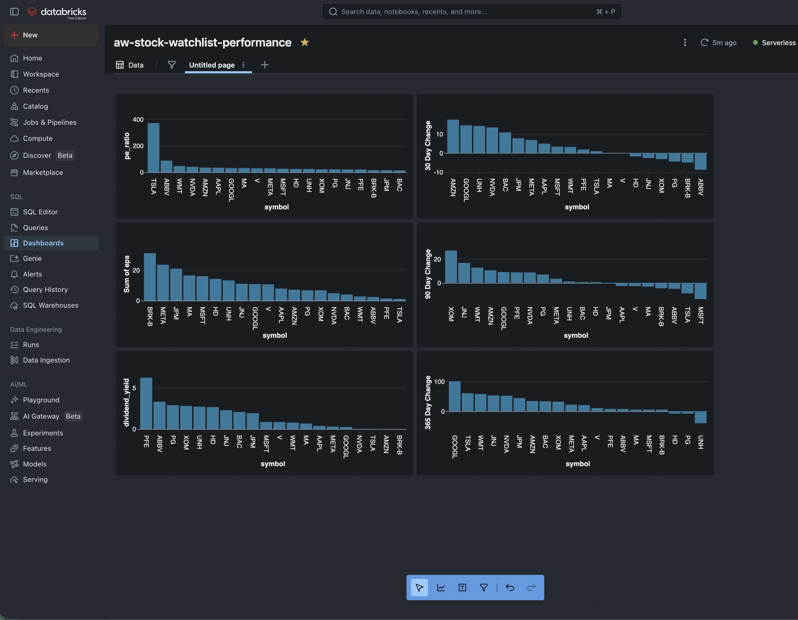
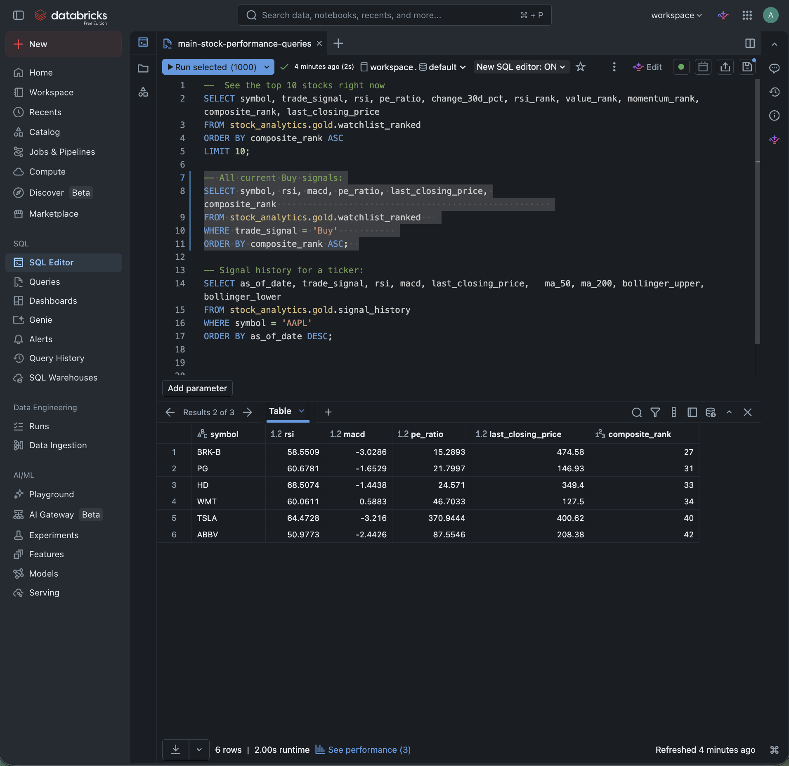
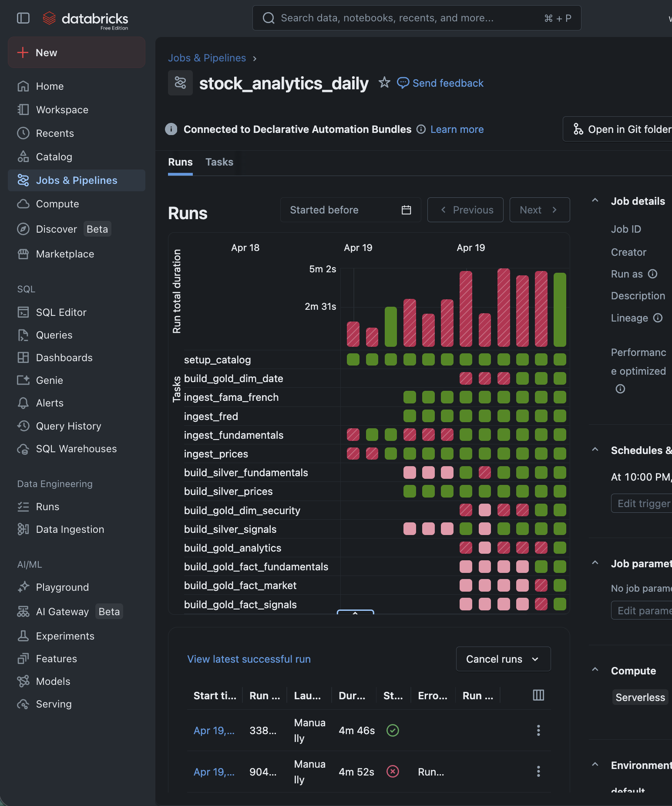

<p align="center">
  
</p>

<h1 align="center">Stock Analytics Lakehouse</h1>

<p align="center">
  <strong>Equity market analytics and portfolio decision support on Databricks</strong>
</p>

<p align="center">
  
  
  
  
</p>

<p align="center">
  <a href="#quick-start">Quick Start</a> &middot; <a href="#tables">Tables</a> &middot; <a href="#sample-queries">Queries</a> &middot; <a href="#visualization-tips">Visualization</a> &middot; <a href="#indicator-formulas">Formulas</a>
</p>

---

<p align="center">
  <br>
  <em>Query results in Databricks SQL Editor</em>
</p>

<p align="center">
  <br>
  <em>Pipeline deployment in Databricks</em>
</p>

---

## Features

| | Feature | Detail |
|:-:|---------|--------|
| :chart: | **Configurable watchlist** | 20 default tickers, or any list via `.env` — no code changes |
| :chart_with_upwards_trend: | **30+ indicators per ticker** | RSI, MACD, Bollinger %B/BandWidth, OBV, MFI, ATR, EMAs, Sharpe, Sortino, max drawdown, beta |
| :wrench: | **Wilder's smoothing** | Industry-standard RSI/ATR with citations, not Cutler's SMA variant |
| :diamond_shape_with_a_dot_inside: | **Kimball star schema** | `dim_date` (NYSE calendar), `dim_security` (SCD2), 3 fact tables |
| :mag: | **One Big Table** | `gold.daily_analytics` — every column, zero joins |
| :lock: | **Point-in-time Bronze** | `_run_id`, `_ingest_ts`, `_source_event_ts` on every row |
| :arrows_counterclockwise: | **SCD2 fundamentals** | PE, EPS, analyst targets tracked with version history |
| :trophy: | **4-dim composite scoring** | Momentum, value, risk, quality — PERCENT_RANK normalized |
| :bell: | **Signal alerts** | RSI crossover, MACD flip, Bollinger squeeze, MA-200 cross, dividend trap |
| :globe_with_meridians: | **Macro context** | FRED yield curve, Fed funds, unemployment, CPI + Fama-French 5-factor |
| :white_check_mark: | **Data quality checks** | Null %, duplicate keys, impossible prices, date monotonicity |

---

## Pipeline DAG

14 tasks, fully parallelized where possible:

```
setup_catalog
 ├── ingest_prices ─────────────────┐
 ├── ingest_fundamentals ──────────┤  Bronze
 ├── ingest_fred ───────────────────┤  (append-only)
 ├── ingest_fama_french ────────────┘
 │
 ├── build_silver_prices ────────────┐
 │   build_silver_fundamentals ──────┤  Silver
 │   build_silver_signals ────────────┘  (MERGE dedup)
 │
 ├── build_gold_dim_date ────────────────┐
 │   build_gold_dim_security ─────────────┤  Gold dims
 │                                         │
 │   build_gold_fact_market ───────────────┤  Gold facts
 │   build_gold_fact_fundamentals ────────┤  (star schema)
 │   build_gold_fact_signals ──────────────┘
 │
 └── build_gold_analytics ──────────────── Gold serving tables
```

<details>
<summary><strong>Scheduling &amp; Data Accumulation</strong></summary>

The pipeline runs **daily after US market close** (10 PM ET, Mon-Fri). NYSE closes at 4 PM ET; yfinance data is typically available by 5-6 PM.

| Cadence | Cron | Trade-off |
|---------|------|-----------|
| **Daily (recommended)** | `0 0 22 ? * MON-FRI` | Captures every trading day |
| Weekly | `0 0 22 ? * FRI` | Misses intraweek signal flips |
| Ad-hoc | Manual | Run after market events |

To change the schedule, edit `databricks.yml` then `databricks bundle deploy`.

Run manually: `databricks bundle run stock_analytics_pipeline`

**Data accumulation per layer:**

| Layer | Behavior | Growth |
|-------|----------|--------|
| Bronze prices | Append every run | ~440 rows/run (20 tickers x 22 days/month) |
| Bronze fundamentals | SCD2 MERGE | New versions only when attributes change |
| Silver prices | MERGE on (symbol, date) | New dates inserted; existing updated |
| Silver signals | MERGE on (symbol, as_of_date) | Same pattern |
| Gold facts | Rebuilt from Silver each run | Contains all accumulated history |
| Gold serving | Rebuilt from Silver each run | Contains all accumulated history |

After 1 year: ~5,040 rows per ticker-level table. After 3 years: ~15,120 rows.

See [`documentation/scheduling-and-accumulation.md`](documentation/scheduling-and-accumulation.md) for full details.

</details>

---

## Tables

### Bronze — Raw Evidence, Append-Only

| Table | Mode | Content |
|-------|------|---------|
| `bronze.daily_prices` | append | OHLCV + `_run_id`, `_ingest_ts`, `_source_event_ts` |
| `bronze.company_fundamentals` | append (SCD2) | Fundamentals with `effective_from/to`, `is_current`, `attr_hash` |
| `bronze.macro_indicators` | append | FRED: Treasury yields, Fed funds, unemployment, CPI |
| `bronze.factor_returns` | append | Fama-French 5-factor + momentum daily returns |

### Silver — Validated, Deduped

| Table | Mode | Key |
|-------|------|-----|
| `silver.daily_prices` | MERGE | `(symbol, date)` |
| `silver.daily_signals` | MERGE | `(symbol, as_of_date)` |
| `silver.fundamentals_current` | MERGE | `(symbol)` — current SCD2 version |

### Gold — Two Ways to Query

#### Star Schema (BI, dashboards, structured analysis)

```
dim_date ──── dim_security ───┬── fact_market_price_daily
                               ├── fact_fundamental_snapshot
                               └── fact_signal_snapshot
```

Three fact tables joined through two conformed dimensions. Each fact is a different business process. Use for drill-across queries, filters, or clear data lineage.

| Table | Mode | Content |
|-------|------|---------|
| `gold.dim_date` | replace | NYSE trading calendar, `is_trading_day`, `is_early_close`, prior/next trading day |
| `gold.dim_security` | MERGE (SCD2) | Ticker name, sector, industry, exchange, country |
| `gold.fact_market_price_daily` | replace | OHLCV + 1d/5d/21d/63d/252d returns |
| `gold.fact_fundamental_snapshot` | replace | PE, EPS, margins, growth, debt ratios |
| `gold.fact_signal_snapshot` | replace | All indicators + PERCENT_RANK composite scores |

#### `gold.daily_analytics` — One Big Table (exploration, ad-hoc, ML)

A single wide table joining signals + prices + fundamentals. **Zero joins needed.**

| Source | Columns |
|--------|---------|
| `silver.daily_prices` | open, high, low, close, volume |
| `silver.daily_signals` | All technical indicators, returns, composite scores |
| `silver.fundamentals_current` | sector, industry, market_cap, PE, EPS, margins, debt |

| | Star Schema | `daily_analytics` |
|:-:|---|---|
| **Joins** | 2-3 per query | Zero |
| **Best for** | BI, drill-across, lineage | Exploration, ML, ad-hoc |
| **Flexibility** | Add new fact independently | Add column = rebuild table |

<details>
<summary><strong>All columns in <code>gold.daily_analytics</code></strong></summary>

```
IDENTITY      symbol, as_of_date
PRICE         open, high, low, close, volume
INDICATORS    trade_signal, rsi, macd, macd_signal_line, macd_histogram,
              bollinger_upper, bollinger_lower, bollinger_pct_b, bollinger_bandwidth,
              obv, mfi, ma_50, ma_200, ema_50, ema_200, atr_14d
RETURNS       last_day_change_abs, last_day_change_pct,
              change_30d_pct, change_90d_pct, change_365d_pct, last_closing_price
FUNDAMENTALS  short_name, long_name, sector, industry, country, currency, exchange,
              market_cap, trailing_pe, forward_pe, price_to_book,
              trailing_eps, forward_eps,
              dividend_rate, dividend_yield, payout_ratio,
              beta, profit_margins, operating_margins, gross_margins,
              revenue_growth, earnings_growth,
              return_on_equity, return_on_assets,
              debt_to_equity, current_ratio, free_cashflow
SIGNALS       dividend_yield, dividend_yield_gap, dividend_yield_trap
```

</details>

### Gold Serving Tables

| Table | Content |
|-------|---------|
| `gold.daily_analytics` | **Master wide table — all prices, indicators, fundamentals. Zero joins.** |
| `gold.watchlist_ranked` | Top tickers by momentum, value, risk, quality, composite |
| `gold.signal_alerts` | RSI cross, MACD flip, Bollinger squeeze, MA cross, yield trap |
| `gold.signal_history` | Time series for charting |
| `gold.benchmark_compare` | vs SPY/QQQ cumulative returns |
| `gold.portfolio_candidates` | top_momentum, oversold, value_dividend, low_volatility |
| `gold.trade_log` | Manual trade journal (INSERT via SQL) |

---

## Sample Queries

### Quick Exploration — `gold.daily_analytics` (zero joins)

```sql
-- Top momentum stocks today
SELECT symbol, short_name, close, change_30d_pct, rsi, composite_score
FROM gold.daily_analytics
WHERE as_of_date = (SELECT MAX(as_of_date) FROM gold.daily_analytics)
ORDER BY change_30d_pct DESC
LIMIT 10;

-- Oversold stocks with strong fundamentals
SELECT symbol, close, rsi, trailing_pe, return_on_equity, sector
FROM gold.daily_analytics
WHERE as_of_date = (SELECT MAX(as_of_date) FROM gold.daily_analytics)
  AND rsi < 30
  AND trailing_pe < 25
  AND return_on_equity > 0.15
ORDER BY rsi;

-- Sector rotation
SELECT sector, AVG(rsi) AS avg_rsi, AVG(change_30d_pct) AS avg_mom, COUNT(*) AS n
FROM gold.daily_analytics
WHERE as_of_date = (SELECT MAX(as_of_date) FROM gold.daily_analytics)
  AND sector IS NOT NULL
GROUP BY sector
ORDER BY avg_rsi DESC;

-- Value stocks with dividend safety
SELECT symbol, close, trailing_pe, dividend_yield, payout_ratio
FROM gold.daily_analytics
WHERE as_of_date = (SELECT MAX(as_of_date) FROM gold.daily_analytics)
  AND trailing_pe BETWEEN 8 AND 18
  AND dividend_yield > 0.02
  AND dividend_yield_trap = false
  AND payout_ratio < 0.75
ORDER BY dividend_yield DESC;
```

### Star Schema — Drill-Across

```sql
SELECT s.sector, s.industry,
       AVG(sig.rsi) AS avg_rsi,
       AVG(f.trailing_pe) AS avg_pe
FROM gold.fact_signal_snapshot sig
JOIN gold.dim_security s ON sig.security_key = s.security_key AND s.is_current = true
JOIN gold.dim_date d ON sig.date_key = d.date_key
LEFT JOIN gold.fact_fundamental_snapshot f
  ON sig.security_key = f.security_key AND sig.date_key = f.date_key
WHERE d.calendar_date = (
  SELECT MAX(calendar_date) FROM gold.dim_date WHERE is_trading_day = TRUE
)
GROUP BY s.sector, s.industry
ORDER BY avg_rsi DESC;
```

### Alerts

```sql
-- Today's signal alerts
SELECT alert_type, symbol, alert_value
FROM gold.signal_alerts
WHERE as_of_date = (SELECT MAX(as_of_date) FROM gold.signal_alerts)
ORDER BY alert_type, symbol;

-- Bollinger squeeze candidates
SELECT symbol, bollinger_bandwidth
FROM gold.daily_analytics
WHERE as_of_date = (SELECT MAX(as_of_date) FROM gold.daily_analytics)
  AND bollinger_bandwidth IS NOT NULL
ORDER BY bollinger_bandwidth ASC
LIMIT 10;
```

### Time Series

```sql
-- 30-day RSI trend for a stock
SELECT as_of_date, rsi, macd, macd_signal_line, bollinger_pct_b
FROM gold.signal_history
WHERE symbol = 'AAPL'
ORDER BY as_of_date DESC
LIMIT 30;

-- Compare vs SPY/QQQ
SELECT symbol, change_30d_pct, spy_change_30d, change_90d_pct, spy_change_90d
FROM gold.benchmark_compare
ORDER BY change_90d_pct DESC;
```

More queries in [`documentation/sql-exploration-queries.md`](documentation/sql-exploration-queries.md).

---

## Visualization Tips

| Chart | Table | How |
|-------|-------|-----|
| Ranked watchlist | `gold.watchlist_ranked` | Bar chart by composite_score DESC, color by sector |
| Momentum heatmap | `gold.daily_analytics` | Pivot sector x change_30d_pct, green-red color scale |
| RSI overbought/oversold | `gold.signal_alerts` | Filter RSI_OVERSOLD/OVERBOUGHT, conditional formatting |
| Bollinger squeeze | `gold.daily_analytics` | Filter low bollinger_bandwidth, small multiples by sector |
| Sector rotation | `gold.daily_analytics` | Scatter: change_30d_pct vs rsi, bubble = market_cap |
| Price + MACD overlay | `gold.signal_history` | Dual-axis: price line + MACD histogram bars |
| Dividend yield trap | `gold.signal_alerts` | Filter DIVIDEND_YIELD_TRAP, red-flagged table |
| Fundamentals radar | `gold.daily_analytics` | Radar chart on normalized PE, yield, margins, ROE, growth |
| Risk-return scatter | `gold.daily_analytics` | x=beta, y=change_365d_pct, color by sector |

Step-by-step tutorials in [`documentation/databricks-visualization-tutorials.md`](documentation/databricks-visualization-tutorials.md).

---

## Quick Start

### Prerequisites

- Databricks CLI (`brew install databricks`)
- Terraform (`brew install terraform`)
- Python 3.11+
- FRED API key ([get one free](https://fred.stlouisfed.org/docs/api/api_key.html))

### 1. Configure

```bash
git clone <repo-url> && cd stock_watch_list_analysis
git checkout develop

cp .env.example .env
# Edit .env: add your tickers, Databricks host, FRED API key
```

### 2. Local Development

```bash
python -m venv stocks-venv && source stocks-venv/bin/activate
pip install -r requirements.txt
pytest tests/ -v
```

### 3. Deploy and Run

```bash
DATABRICKS_TF_EXEC_PATH=$(which terraform) \
DATABRICKS_TF_VERSION=$(terraform version -json | jq -r '.terraform_version') \
databricks bundle deploy

databricks bundle run stock_analytics_pipeline
```

### 4. Explore

```sql
SELECT * FROM stock_analytics.gold.daily_analytics
WHERE as_of_date = (SELECT MAX(as_of_date) FROM stock_analytics.gold.daily_analytics)
ORDER BY composite_score DESC;
```

---

## Indicator Formulas

All formulas use industry-standard definitions with citations.

| Indicator | Formula | Citation |
|-----------|---------|----------|
| RSI (14) | Wilder's smoothing `ewm(alpha=1/14)` | Wilder, "New Concepts" (1978) |
| ATR (14) | Same RMA as RSI | Wilder, same |
| MACD | EMA(12) - EMA(26), signal = EMA(9) | Appel (1979) |
| Histogram | MACD - signal | Standard |
| Bollinger | SMA(20) +/- 2 sigma | Bollinger (2001) |
| %B | (price - lower) / (upper - lower) | Bollinger |
| BandWidth | (upper - lower) / middle | Bollinger |
| OBV | Cumulative +/-volume | Granville (1963) |
| MFI | 100 - 100/(1 + money_ratio) | Quong & Soudack (1989) |
| Sharpe | (return - rf) / sigma | Sharpe, J. Portfolio Mgmt (1994) |
| Sortino | (return - target) / downside sigma | Sortino & Price (1994) |
| Max Drawdown | max peak-to-trough | Standard |
| Beta | Cov(stock, bench) / Var(bench) | Standard |

---

## Architecture Decisions

- **Bronze stores evidence, not truth** — append-only, never overwrite. Every row carries `_run_id`, `_ingest_ts`, `_source_system`, `_source_event_ts`, `_load_type`.
- **Fundamentals are beliefs, not facts** — SCD2 with `attr_hash` change detection suppresses phantom versions from unchanged yfinance replays.
- **Point-in-time correctness** — `_source_event_ts` (trade date) vs `_ingest_ts` (receipt time). Backtests using revised data show 15-25% higher Sharpe ratios. Never confuse them.
- **Kimball in Gold** — star schema with conformed dimensions. Different business processes = different fact tables. Serving tables coexist for dashboards.
- **`gold.daily_analytics` is the exploration surface** — one big table, zero joins, all columns. Start here for ad-hoc questions.
- **PERCENT_RANK not raw RANK** — normalize each dimension to [0,1] before combining. Raw rank sums favor large-cap stocks.
- **Liquid Clustering** on `(symbol, date)` for new tables — no partitioning, no Z-ORDER.

---

## Data Quality

| Layer | Checks |
|-------|--------|
| Bronze | Non-empty, expected columns, null %, price consistency (high >= low, volume >= 0), `_source_event_ts <= _ingest_ts` |
| Silver | `(symbol, date)` dedup verified, no impossible prices, date monotonicity |
| Gold | Latest date exists, rank columns populated, dashboard tables non-empty |

---

## Non-Goals

Tick data, real-time streaming, options, broker integration, autonomous trading, heavy ML, NLP, hourly intraday.

## Resources

- [Databricks Medallion Architecture](https://docs.databricks.com/aws/en/lakehouse/medallion)
- [Databricks Data Modeling](https://docs.databricks.com/aws/en/transform/data-modeling)
- [Kimball Dimensional Modeling Techniques](https://www.kimballgroup.com/wp-content/uploads/2013/08/2013.09-Kimball-Dimensional-Modeling-Techniques11.pdf)
- [Point-in-Time Data for Investment Decisions](https://starqube.com/point-in-time-data/)
- [Databricks Liquid Clustering](https://databricks.com/blog/announcing-general-availability-liquid-clustering)
- [FRED API](https://fred.stlouisfed.org/docs/api/fred/)
- [Fama-French Data Library](https://mba.tuck.dartmouth.edu/pages/faculty/ken.french/data_library.html)